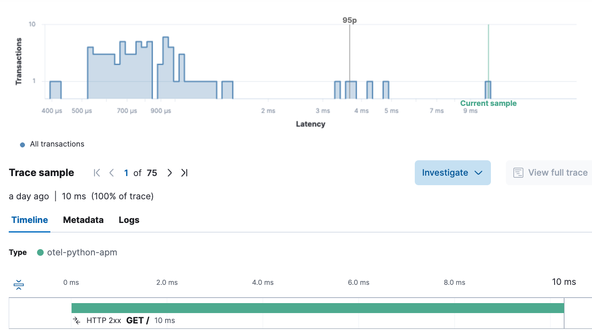

# 🚀 OpenTelemetry Exporter Setup

This project demonstrates how to configure and run the OpenTelemetry Collector to export telemetry data from a Python App to Elastic APM using the OTLP protocol. 📡🔍

## 📌 Requirements

Before you begin, make sure you have the following dependencies installed:

```sh
$ python3 -m venv venv
$ source venv/bin/activate
$ pip install -r requirements.txt
```

## ⚙️ Configuring the Exporter

Edit the _**otel-collector-config.yaml**_ file with the following content:

```yaml
receivers:
  otlp:
    protocols:
      grpc:
        endpoint: 0.0.0.0:4317
      http:
        endpoint: 0.0.0.0:4318

exporters:
  debug:
    verbosity: detailed 
  otlp:
    endpoint: "https://97e7XXXX7c2adbbbfe0.apm.us-central1.gcp.cloud.es.io:443"
    headers:
      Authorization: "ApiKey YnV4ekZaVU(...)F6dnZpU2RETi1wUQ=="

service:
  pipelines:
    traces:
      receivers: [otlp]
      exporters: [otlp, debug]
    metrics:
      receivers: [otlp]
      exporters: [otlp, debug]
    logs:
      receivers: [otlp]
      exporters: [otlp, debug]
```

💡 Tip: Remember to set your APM Endpoint and an API KEY in this file!

## 🚀 Running the OpenTelemetry Collector

To start the OpenTelemetry Collector using Docker, run the following command:

```sh
docker run --rm -p 4317:4317 -p 4318:4318 -v $(pwd)/otel-collector-config.yaml:/etc/otel-collector-config.yaml otel/opentelemetry-collector-contrib:latest --config /etc/otel-collector-config.yaml
```

💡 Tip: If running on a different machine, update the IP address in the configuration file accordingly.

## ▶️ Running the Python App

```sh
$ python app.py
```

💡 Tip: Before start your python app remember to edit the variables in the **.env** file.

```js
OTEL_ENDPOINT = "192.168.1.249"
APP_NAME = "otel-python-apm" 
APP_VERSION = "0.1"
```

## 📊 Viewing APM Metrics
Once the setup is complete, you can view the APM metrics using Kibana. 📈✨




## 🔗 Useful Links

* 📖 OpenTelemetry Exporter Documentation: [OpenTelemetry Exporters](https://opentelemetry.io/docs/languages/python/exporters/#usage)
* 📖 OpenTelemetry Instrumentation Documentation: [OpenTelemetry Instrumentation](https://opentelemetry.io/docs/languages/python/instrumentation/)
* 📖 OpenTelemetry Flask Instrumentation Documentation: [OpenTelemetry Flask Instrumentation](https://pypi.org/project/opentelemetry-instrumentation-flask/)

### 🎯 Now you're all set to monitor your applications with OpenTelemetry! 🚀🐍
### Happy Observing! 👀🔍